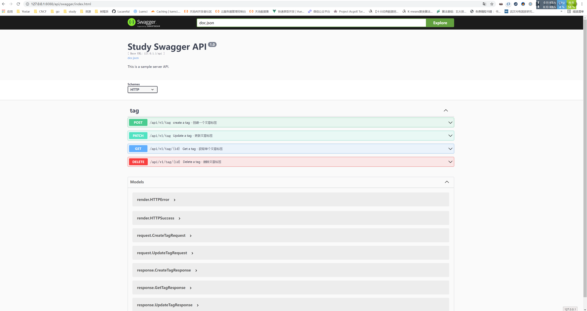

# gin-demo

## 前言
> 本项目参考自 [煎鱼](https://github.com/eddycjy) 系列文章 [《Gin搭建Blog API's》](https://eddycjy.com/posts/go/gin/2018-02-11-api-01)
> 我重构了整体的目录结构和代码，加入自己的一些想法和实践，来练习相关知识点，增加自己的对知识点的掌控。


## 目录结构

```shell
..
├── CHANGELOG.md
├── README.md
├── api.http
├── config
│   ├── app.ini
│   └── config.yml
├── docs
│   ├── docs.go
│   ├── img.png
│   ├── swagger.json
│   └── swagger.yaml
├── go.mod
├── go.sum
├── main.go
├── middleware
│   ├── cors.go
│   ├── rabc.go
│   └── timter.go
├── models
│   ├── article.go
│   ├── models.go
│   ├── rbac.go
│   └── tag.go
├── pkg
│   ├── e
│   ├── http
│   ├── joint
│   ├── rbac
│   ├── setting
│   ├── tools
│   └── util
├── routers
│   ├── api
│   └── router.go
├── run-go-vet.sh
├── runtime
├── service
│   ├── service.go
│   ├── service_article.go
│   └── service_tag.go
├── tests
│   ├── concatStr_test.go
│   ├── rabc_test.go
│   └── validator_test.go
├── types
    ├── request
    └── response


```

## 接口API文档（swagger）



## 开发 TODO list

- [x] 目录结构重构
- [ ] 代码补充 & 重构(50%)
- [x] [pkg 模块抽离](https://github.com/luenci)
- [x] [oauth2 认证服务](https://github.com/Lucareful/oauth2-server)
- [x] 接口文档 swagger 引入
- [ ] websocket 流式日志 & eventStream
- [ ] rbac 权限校验
- [ ] gRPC 调用 实践
- [ ] gRPC-gateway 实践
